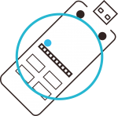

# NefryのSWを押した時にNefryからIFTTTにトリガーをかけます。

<!-- プログラムの内容を記載してください。  -->
NefryのSWを押した時にIFTTTにトリガーがかかるようになります。
私がLIGブログに寄稿した記事をベースにしています。
[Webサービス同士を連携できる「IFTTT」と自作IoTデバイスを繋いで生活を便利にしてみた](https://liginc.co.jp/263899)

## 必要なもの、ツール

<!-- 表 -->

||
|:---:|
|Nefry|
|IFTTT|

## 動作確認

|Nefry|
|:---:|
||

## ダウンロードリンク
ダウンロードリンクとは、Nefry Web ConfigのWeb updateのページのURIに入力することでNefry自身がプログラムをダウンロードして更新ができるものになります。

!!!link
	/Nefry/IFTTT/Send/IFTTTSwitch

##サンプルプログラム

<!-- 接続例があればなおよい -->

<!-- gh-pages以下の部分を変更してください。 -->

